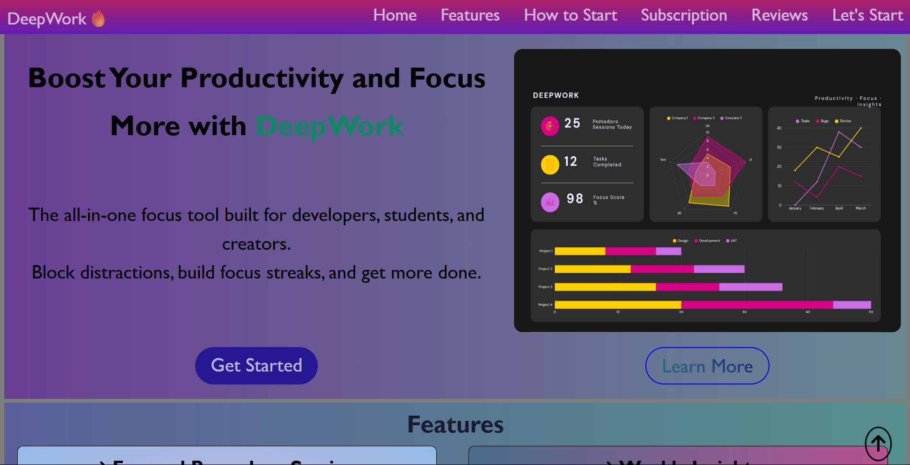

# DEEPWORK - A PRODUCTIVITY LANDING PAGE
A fictional productivity app landing page build with HTML5 and CSS3.

## About
This is my first major landing page since I started learning.

## Features
- Fully responsive design (mobile-first approach)
- Modern hero section with CTA
- Features grid with hover effects
- Pricing tiers
- Testimonials section
- Smooth navigation and scroll behavior

## Technologies Used
- HTML5 (Semantic markup)
- CSS3 (Flexbox, Grid, Variables, Transitions, Animations)
- Font Awesome icons

## What I Learned
- Building complex layouts with CSS Grid and Flexbox
- Creating responsive designs using mobile-first approach
- Using CSS variables for consistent theming
- Adding smooth animations and transitions
- Organizing a larger CSS project

## Live Link
[View Live](https://deepwork-productivity.netlify.app/)

## Preview

